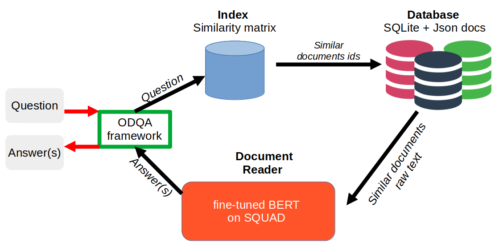

# talk-to-textual-data
An Open Domain Question Answering chat box allowing you to talk to your textual data.

#NLP #BERT #HuggingFace #ODQA #Flask #gunicorn #NLTK #SQL

This application has been designed to allow anyone with low computing resources to index and query textual data using a chat-like interface. The app backend is implemented in Python and uses an Open Domain Question Answering framework to serve the queries. The app frontend is implemented with HTML/CSS/JS.

## How to run
### Requirements
See file "requirements.txt" for required packages
### Setup
- run "python setup_data.py" to setup your "data" folder structure, your index and database. A message will print asking you to add your documents at data/odqa_data/documents/.

- Generate your json documents and add them inside data/odqa_data/documents/. See [this section](#anch0) For more details.

- Then, relaunch "python setup_data.py" to complete the setup and download required data (NLTK + hugginface transformers model)

- Once all downloads are done, run "./start_flask.sh" to run a development flask server and talk with your data.

## Application structure
### DATA folder 
This is where all the data are saved. In data/odqa_data/documents/ you have all the json documents used by the application. Each document is a json file with the required fields : title, text and url. "title" is the document title, "text" is the document content and the most important field "url" is the path where one can have more details about this document. Can be a website url on any path accessible from your app. (See odqapy/tests/test_data/document_example.json). 
If you want to talk to a website, you can scrap its data and save it. There is a notebook tutorial inside web_scraping_tuto/ with an example on how it can be done with [BeautifulSoup](https://www.crummy.com/software/BeautifulSoup/bs4/doc/)   
### Webapp (Frontend)
This part has been mostly inspired from https://github.com/zaghaghi/drqa-webui
It is an interface where you can ask a question about your data. If you scrap data from your website, you can thus literally talk to your website instead of browsing it.

However, one should keep in mind that the answers accuracy are bound to the keywords you use in your question. If there is no matching keywords between your question and your documents, the answers can be quite random.

### ODQA framework (Backend)
This is where the magic occurs ;). The backend has 3 main components:
- The index: It is an object able to compute similarity between the input question and indexed documents. It used data located at data/odqa_data/docs_index/. This folder contains the matrix similarity which is just a sparse matrix containing the vector representation of all your indexed documents. This matrix will be used to computed similarity between the user question and all the documents at once. The folder also contains objects for preprocessing raw input text.
More details here odqapy/index.py

- The database: It is a SQLite database with all information about your documents. The framework is flexible enough to let you add your own database (NoSQL,..).
More details here odqapy/db.py

- The Document Reader: It is an object able to get answers from the input question using a pretrained BERT model finetuned on SQUAD dataset. The default model here is a distillbert from huggingface (https://huggingface.co/transformers/model_doc/distilbert.html#tfdistilbertforquestionanswering)

## DEPLOYMENT

- If you want to deploy your app for many users, run "./start_server.sh" to launch gunicorn server. Also, if you want to put your server in production, please follow gunicorn advices and run it behind nginx. (https://gunicorn.org/#deployment)
- Most of the code has been unit tested under odqapy/tests/ using pytest. There is still room for improvment there
